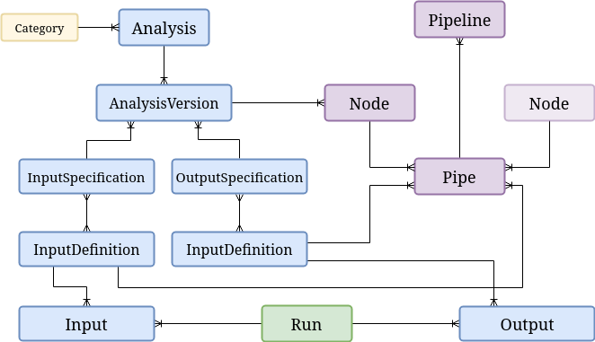

Overview
========

*django_analyses* provides a database-supported pipeline engine meant to facilitate
research management.

A general schema for pipeline management is laid out as follows:

Analyses
--------

Each :class:`~django_analyses.models.analysis.Analysis` may be associated with a number of
:class:`~django_analyses.models.analysis_version.AnalysisVersion` instances, and each of
those must be provided with an interface, i.e. a Python class exposing some `run()` method
and returning a dictionary of results.

Input and Output Specifications
...............................

:class:`~django_analyses.models.input.input_specification.InputSpecification` and
:class:`~django_analyses.models.output.output_specification.OutputSpecification` each
aggregate a number of
:class:`~django_analyses.models.input.definitions.input_definition.InputDefinition`
and :class:`~django_analyses.models.output.definitions.output_definition.OutputDefinition`
sub-classes (respectively).

Input and Output Definitions
............................

Currently, there are seven different types of built-in input definitions:

    * :class:`~django_analyses.models.input.definitions.boolean_input_definition.BooleanInputDefinition`
    * :class:`~django_analyses.models.input.definitions.directory_input_definition.DirectoryInputDefinition`
    * :class:`~django_analyses.models.input.definitions.file_input_definition.FileInputDefinition`
    * :class:`~django_analyses.models.input.definitions.float_input_definition.FloatInputDefinition`
    * :class:`~django_analyses.models.input.definitions.integer_input_definition.IntegerInputDefinition`
    * :class:`~django_analyses.models.input.definitions.list_input_definition.ListInputDefinition`
    * :class:`~django_analyses.models.input.definitions.string_input_definition.StringInputDefinition`

and two different kinds of supported output definitions:

    * :class:`~django_analyses.models.output.definitions.file_output_definition.FileOutputDefinition`
    * :class:`~django_analyses.models.output.definitions.float_output_definition.FloatOutputDefinition`

Each one of these :class:`~django_analyses.models.input.definitions.input_definition.InputDefinition`
and :class:`~django_analyses.models.output.definitions.output_definition.OutputDefinition` sub-classes
provides unique validation rules (default, minimal/maximal value or length, choices, etc.), and you
can easily create more definitions to suit your own needs.

Pipelines
---------

:class:`~django_analyses.models.pipeline.pipeline.Pipeline` instances are used to reference
a particular collection of :class:`~django_analyses.models.pipeline.node.Node` and
:class:`~django_analyses.models.pipeline.pipe.Pipe` instances. Each
:class:`~django_analyses.models.pipeline.node.Node` defines a particular combination of analysis
version and configuration, and each :class:`~django_analyses.models.pipeline.pipe.Pipe` connects
between one node's output definition and another's input definition.

Runs
----

:class:`~django_analyses.models.run.Run` instances are used to keep a record of every time
an analysis version is run with a distinct set of inputs and outputs.