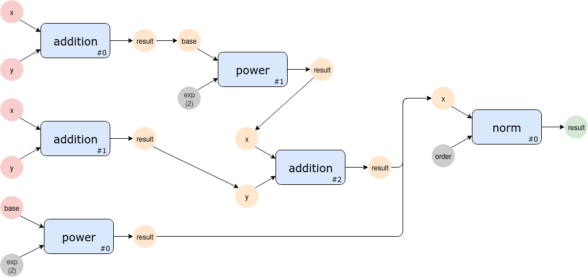

Multiple Identical Nodes
========================

In cases where a particular node needs to be executed multiple times in the
same pipeline, the :class:`~django_analyses.models.pipeline.pipe.Pipe` model's
:attr:`~django_analyses.models.pipeline.pipe.Pipe.source_run_index` and
:attr:`~django_analyses.models.pipeline.pipe.Pipe.destination_run_index`
attributes should be used.

As an example for a pipeline running multiple identical nodes, we will create
the following pipeline:

We will assume the existence of the three nodes:

    * *addition*: Adds two number to return "result".
    * *power*: Raises *base* in the power of *exp*. In this case we have a
      "square" node, where *exp* is preconfigured as 2.
    * *norm*: Calculated the norm of the provided vector (*x*) using NumPy's
      :meth:`linalg.norm()` method.

Each node has a designated run index in it's bottom right corner,
distinguishing it from other executions of this node.

To create the pipeline, we will first create a pipeline specification
dictionary:

.. code-block:: python
    :caption: multiple_identical_nodes.py

    ADDITION_NODE = {
        "analysis_version": "addition",
        "configuration": {},
    }
    SQUARE_NODE = {
        "analysis_version": "power",
        "configuration": {"exp": 2},
    }
    NORM_NODE = {
        "analysis_version": "norm",
        "configuration": {},
    }
    PIPELINE = {
        "title": "Multiple Identical Nodes",
        "description": "Simple pipeline with identical nodes.",
        "pipes": [
            # Addition #0 [result] --> Power #1 [base]
            {
                "source": ADDITION_NODE,
                "source_run_index": 0,
                "source_port": "result",
                "destination": SQUARE_NODE,
                "destination_run_index": 1,
                "destination_port": "base",
            },
            # Power #1 [result] --> Addition #2 [x]
            {
                "source": SQUARE_NODE,
                "source_run_index": 1,
                "source_port": "result",
                "destination": ADDITION_NODE,
                "destination_run_index": 2,
                "destination_port": "x",
            },
            # Addition #1 [result] --> Addition #2 [y]
            {
                "source": ADDITION_NODE,
                "source_run_index": 1,
                "source_port": "result",
                "destination": ADDITION_NODE,
                "destination_run_index": 2,
                "destination_port": "y",
            },
            # Power #0 [result] --> Norm #0 [x[0]]
            {
                "source": SQUARE_NODE,
                "source_run_index": 0,
                "source_port": "result",
                "destination": NORM_NODE,
                "destination_run_index": 0,
                "destination_port": "x",
                "index": 0,
            },
            # Addition #2 [result] --> Norm #0 [x[1]]
            {
                "source": ADDITION_NODE,
                "source_run_index": 2,
                "source_port": "result",
                "destination": NORM_NODE,
                "destination_run_index": 0,
                "destination_port": "x",
                "index": 1,
            },
        ],
    }

Note that we also used the :class:`~django_analyses.models.pipeline.pipe.Pipe`
model's :attr:`~django_analyses.models.pipeline.pipe.Pipe.index` attribute to
pass two outputs as a single list (vector) to the *norm* nodes *x* parameter.

To run the pipeline, we need to specify both *x* and *y* for the first two
*addition* executions, as well as the base to the first *power* execution.

.. code-block:: python

    >>> from django_analyses.models import AnalysisVersion
    >>> from django_analyses.models import Node
    >>> from django_analyses.models import Pipeline
    >>> from django_analyses.pipeline_runner import PipelineRunner

    # Import the pipeline specification dictionary created above
    >>> from multiple_identical_nodes import PIPELINE
    # Create the pipeline
    >>> pipeline = Pipeline.objects.from_dict(PIPELINE)

    # Fetch the nodes for the inputs dictionary
    >>> addition = AnalysisVersion.objects.get(analysis__title="addition")
    >>> power = AnalysisVersion.objects.get(analysis__title="power")
    >>> addition_inputs = [{"x": 1, "y": 1}, {"x": 1, "y": 1}]
    >>> power_inputs = [{"base": 1}]
    >>> inputs = {addition: addition_inputs, power: power_inputs}
    >>> runner = PipelineRunner(pipeline=pipeline)
    >>> results = runner.run(inputs=inputs)
    Running power v1.0 with configuration:
    {'base': 1}
    done!

    Running addition v1.0 with configuration:
    {'x': 1, 'y': 1}
    done!

    Running power v1.0 with configuration:
    {'base': 2.0}
    done!

    Running addition v1.0 with configuration:
    {'x': 1, 'y': 1}
    done!

    Running addition v1.0 with configuration:
    {'y': 2.0, 'x': 4.0}
    done!

    Running norm vNumPy:1.18 with configuration:
    {'x': [1.0, 6.0]}
    done!
    >>> norm = AnalysisVersion.objects.get(analysis__title="norm")
    >>> results[norm][0].get_output("norm")
    6.082762530298219