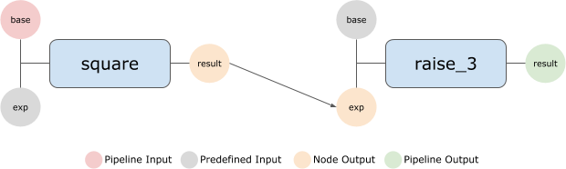

Pipeline Execution
==================

Pipelines are executed using a :class:`~django_analyses.pipeline_runner.PipelineRunner`
instance, which wraps-up all the required logic.

We will use the *"Simple Pipeline"* created in the
:ref:`user_guide/pipeline_generation/simplified_example:Simplified Pipeline Generation Example`
to calculate :math:`3^{2^2}`.

*"Simple Pipeline" Illustration. In the following example, we will pass 2 as
the "base" input for the "square" node.*

.. code-block:: python

    >>> from django_analyses.pipeline_runner import PipelineRunner
    >>> from django_analyses.models import Node
    >>> pipeline = Pipeline.objects.get(title="Simple Pipeline")
    >>> pipeline_runner = PipelineRunner(pipeline)
    >>> square_node = Node.objects.get(analysis_version__analysis__title="Exponentiation")
    >>> runs = pipeline_runner.run(inputs={square_node: [{"base": 2}]})

The returned :obj:`runs` variable is a :obj:`dict` instance containing the
pipeline's nodes as keys lists of runs as values. Examining :obj:`runs` will
show that :math:`2^2` returned :obj:`[Run #1]` (which was created at the
beginning of the pipeline generation tutorial), whereas :math:`3^4` was a
novel calculation and therefore a new run has been was created.

Finally, to view our output:

.. code-block:: python

    >>> from django_analyses.models.analysis_version import AnalysisVersion
    >>> raise_3 = AnalysisVersion.objects.get(analysis__title="Exponentiation").first()
    >>> runs[raise_3].get_output("result")
    81

Specifying User Inputs
----------------------

User inputs are expected to be provided as a dictionary with nodes as keys and
lists of dictionary input configurations as values. This format enables a user
to specify inputs for multiple entry points, as well as multiple runs of a
particular entry node, in case it is required. However, in many cases,
pipelines either only have a single entry point or single executions of a
number of entry points.

Single Entry Point Input Configuration
......................................

For this reason, in case there is only a single entry point, the required input
configuration dictionary may be assigned directly, e.g. in the base
:ref:`user_guide/pipeline_generation/pipeline_execution:Pipeline Execution`
example above, we could have also used:

.. code-block:: python

    >>> runs = pipeline_runner.run(inputs={"base": 2})

Because *square_node* is the only entry point in the pipeline, the input
configuration dictionary will automatically be assigned to that node.

